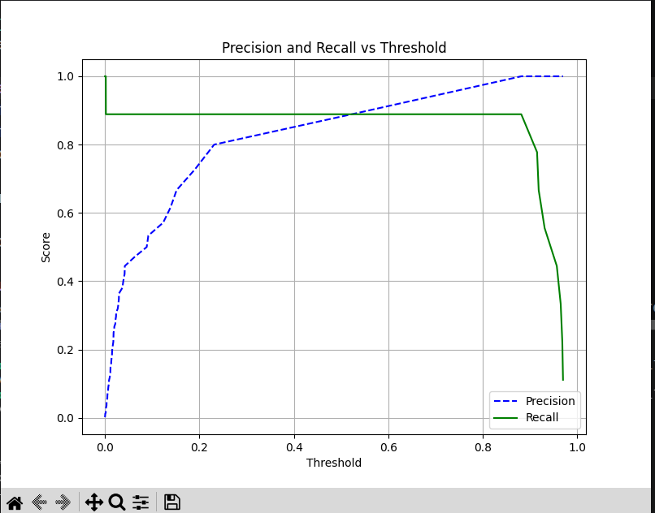
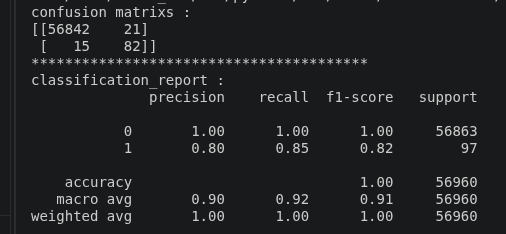

# Fraud Detection System

## Overview
An end-to-end machine learning classification system designed to detect fraudulent transactions in highly imbalanced financial data.

## Methodology
* **Data Preprocessing:** Handled an anonymized dataset, applying `RobustScaler` specifically to the `Time` and `Amount` features to effectively manage outliers.
* **Imbalance Handling:** Addressed extreme class imbalance where legitimate transactions (Class 0) were 570 times more frequent than fraudulent ones (Class 1).
* **Modeling:** Engineered a robust ensemble model using a `VotingClassifier` that combines `RandomForest`, `XGBoost`, and `CatBoost`.
* **Optimization:** Performed hyperparameter tuning using `GridSearchCV` to select the best parameters for the base models.
* **Threshold Adjustment:** Plotted a Precision-Recall curve to move beyond the default 0.5 classification threshold. Established an optimal threshold of 0.55 to maximize recall without heavily penalizing precision.

## Performance & Results
The model was evaluated on an unseen test dataset of 56,960 samples. 

**Metrics for the Fraud Class (Class 1):**
* **Precision:** 0.80
* **Recall:** 0.85
* **F1-Score:** 0.82
* **Overall Accuracy:** 1.00

**Confusion Matrix Breakdown:**
* **True Positives:** 82 (Fraudulent transactions successfully caught)
* **False Negatives:** 15 (Fraudulent transactions missed)
* **True Negatives:** 56,842 (Legitimate transactions correctly approved)
* **False Positives:** 21 (Legitimate transactions falsely flagged)

## Business Impact
Achieving an 85% recall rate significantly prevents financial losses by capturing the vast majority of fraudulent activities. Simultaneously, the exceptionally low false-positive rate guarantees that genuine customer transactions remain largely undisrupted.

## Visualizations
*(Note: Upload the images to your repository and update the paths below)*

### Precision-Recall vs Threshold

### Test Results (Confusion Matrix & Report)

## Technologies Used
* Python
* Scikit-Learn
* XGBoost
* CatBoost
* Pandas & NumPy
* Matplotlib
